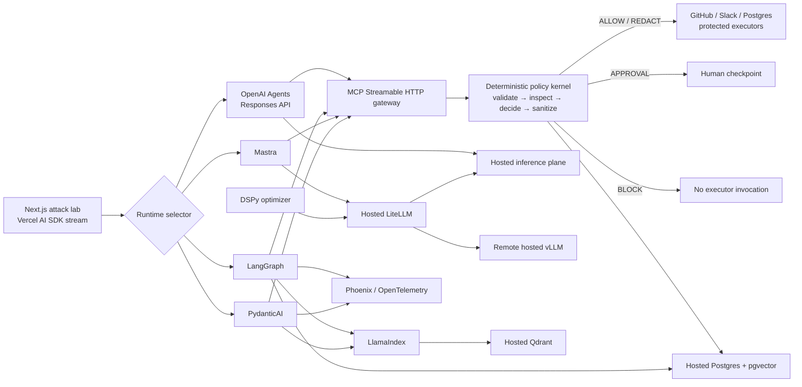

# Architecture

AgentGuard separates deterministic enforcement from probabilistic analysis. A model may recommend; only the policy kernel can authorize execution.

## Enforcement sequence

1. A runtime proposes a typed tool call.
2. The MCP gateway creates a `GuardRequest` with principal, environment, risk, arguments, and provenance.
3. Zod rejects malformed requests before any policy runs.
4. The deterministic engine detects prompt injection, destructive SQL, credential egress, production changes, and financial thresholds.
5. Policy precedence is `BLOCK > APPROVAL > REDACT > ALLOW`.
6. Only `ALLOW` and sanitized `REDACT` requests may reach an executor.
7. Every decision extends the SHA-256 audit chain and, when configured, persists to hosted Postgres.

## Hosted-only rule

- `OPENAI_API_KEY` targets OpenAI-hosted models.
- LiteLLM is addressed through `LITELLM_BASE_URL`; it is not started by this repository.
- vLLM is addressed through `VLLM_BASE_URL`; no weights or serving process are installed locally.
- The Python intelligence container contains application code only—no model weights.
- Postgres, Qdrant, and Phoenix use HTTPS/TLS service URLs supplied at deployment time.

## Degraded mode

When credentials are absent, all security decisions, attack streams, approval UX, audit hashes, and simulated execution receipts still work. Live-adapter routes return an explicit `503` with a configuration hint instead of silently falling back to a local model.

